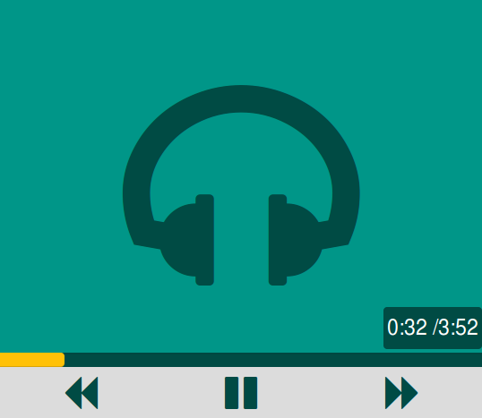

<h3>HTML5 Audio Player</h3>
<p>A minimal UI for the HTML5 audio player.</p>

<p>Its light and responsive. Instead of using cover art in the player it uses different background colors everytime you refresh the page which even saves page load time.</p>
<h4>How to use:</h4>
<p>Include the css files in the header and the js files just before the closing body tag</p>
```html
<!-- CSS Files-->
	<head>
    	<link rel="stylesheet" href="https://maxcdn.bootstrapcdn.com/bootstrap/3.3.1/css/bootstrap.min.css">
    	<link href="https://maxcdn.bootstrapcdn.com/font-awesome/4.2.0/css/font-awesome.min.css" rel="stylesheet">
    	<link rel="stylesheet" type="text/css" href="css/audio_player.css">
	</head>
	<body>
	<!--AUDIO PLAYER CODE goes here -->
	<!-- JS Files-->
       <script src="https://ajax.googleapis.com/ajax/libs/jquery/1.11.0/jquery.min.js"></script>
       <script src="https://maxcdn.bootstrapcdn.com/bootstrap/3.3.1/js/bootstrap.min.js"></script>
       <script type="text/javascript" src="js/audio_player.js"></script>
    </body>
```
<p>Change the source for the audio file in the audio tag on the page</p>
```html
<audio controls preload="auto" hidden id="audio-file" >
          <source src="media/water.mp3" type="audio/mpeg">
          <source src="media/water.ogg" type="audio/ogg">
</audio>
```
<p>Just download the resources and include the audio player partial if you want to plug it into a rails project as: </p>
```ruby
<%=render :partial=>"audio_player"%>
```
<p>Or use the code from audio_player.html file into your project</p>


